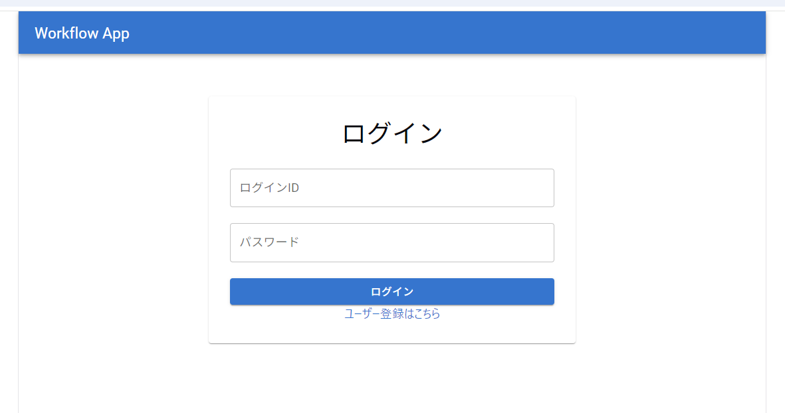
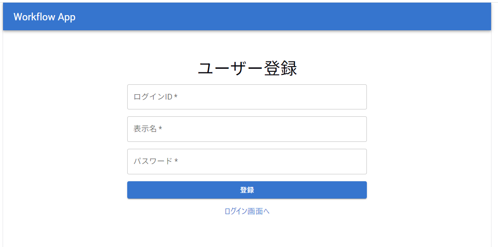
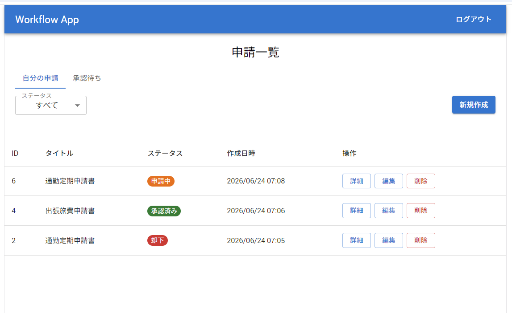
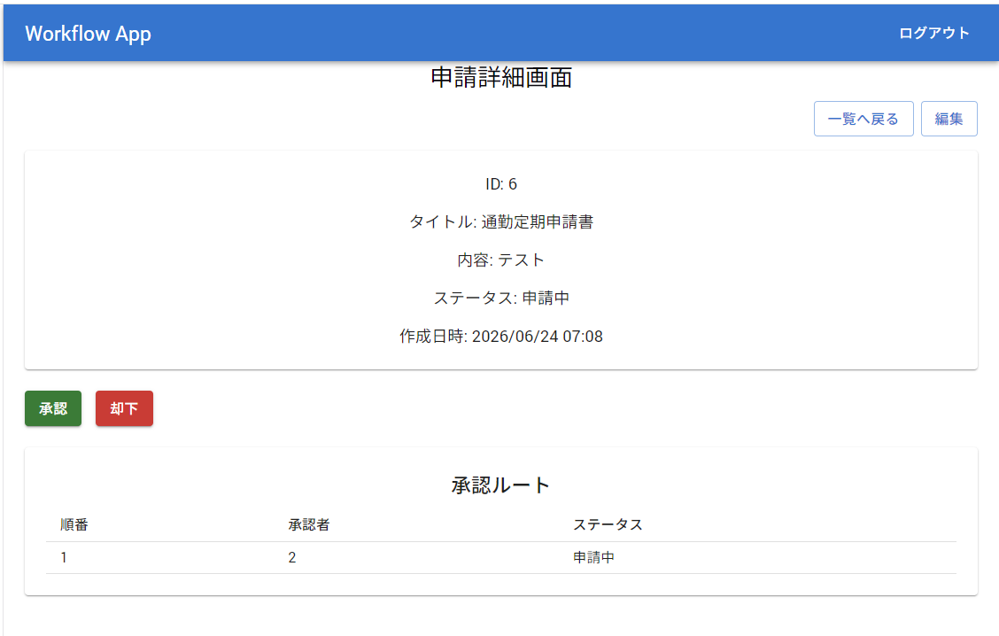
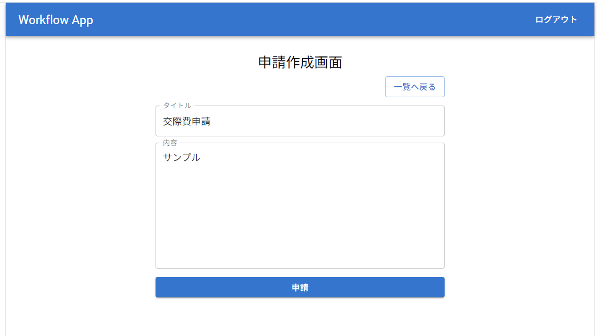
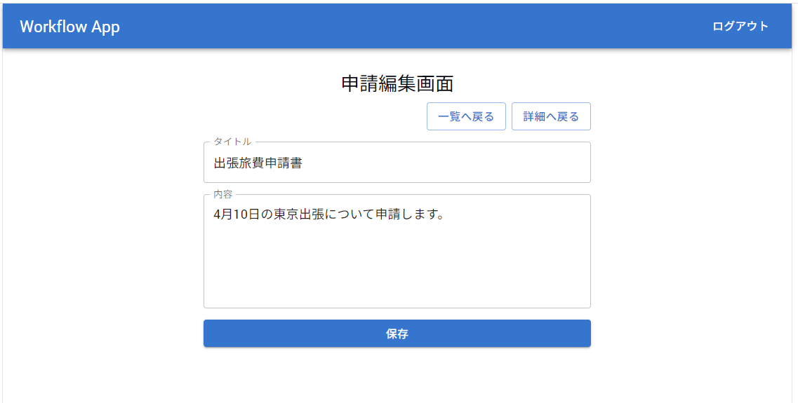

# Workflow App Frontend

業務ワークフローの「申請・承認」を想定したフロントエンドアプリケーションです。  
React + TypeScript + Vite で構築しており、ASP.NET Core Web API と連携して動作します。

現在は、認証、申請一覧、申請詳細、申請作成、申請編集、申請削除、ステータス変更、ページネーション、ステータス絞り込みを実装しています。

---

## 画面イメージ

### ログイン画面



### ユーザー登録画面



### 申請一覧画面



### 申請詳細画面



### 申請作成画面



### 申請編集画面



---

## 作成背景

これまでデスクトップアプリケーション中心の開発経験が多かったため、Web アプリケーション開発、特に React / TypeScript によるフロントエンド実装の習得を目的として作成しています。

本プロジェクトでは、以下を意識しています。

- React + TypeScript による画面実装
- React Router による画面遷移とルート制御
- Axios による Web API 連携
- JWT を使った認証状態管理
- MUI を使った UI 構築
- Vitest / Testing Library によるフロントエンドテスト
- API 通信を含む画面単位の状態管理
- バリデーション、エラー表示、ローディング表示の実装
- ページネーション、絞り込み、ステータス更新などの業務アプリケーション向け機能の実装

---

## 使用技術

| 分類              | 技術                     |
| ----------------- | ------------------------ |
| フレームワーク    | React 19                 |
| 言語              | TypeScript               |
| ビルドツール      | Vite                     |
| ルーティング      | React Router DOM         |
| HTTP クライアント | Axios                    |
| UI ライブラリ     | MUI                      |
| テスト            | Vitest / Testing Library |
| 静的解析          | ESLint                   |

---

## 主な機能

### 認証

- ログイン
- ユーザー登録
- JWT の保存 / 削除
- 認証済み / 未認証によるルート制御
  - 未認証時は `/login` へリダイレクト
  - 認証済み時は `/applications` へリダイレクト
- ヘッダーからのログアウト
- ログイン中ユーザー情報の取得

### 申請一覧

- 申請一覧の取得
- 申請一覧テーブルの表示
- ステータスのラベル表示
  - 申請中
  - 承認済み
  - 却下
- ステータスに応じた Chip 表示
- 作成日時の表示形式変換
- ページネーション
- ステータス絞り込み
- 絞り込み変更時のページリセット
- 読み込み中表示
- エラー表示
- データ 0 件時のメッセージ表示
- 申請作成画面への遷移
- 詳細 / 編集 / 削除操作

### 申請詳細

- URL パラメータから申請 ID を取得
- 申請詳細の取得
- 申請内容の表示
  - ID
  - タイトル
  - 内容
  - ステータス
  - 作成日時
- 一覧画面への戻る操作
- 編集画面への遷移
- 申請ステータスの更新
  - 承認
  - 却下
- ステータス更新前の確認ダイアログ表示
- ステータス更新成功 / 失敗時のメッセージ表示
- 不正な ID のエラー表示
- API 取得失敗時のエラー表示

### 申請作成

- タイトル / 内容の入力
- 入力値のトリム処理
- タイトル未入力時のバリデーション
- 内容未入力時のバリデーション
- 入力項目ごとのエラーメッセージ表示
- 申請作成 API の呼び出し
- 作成成功後、申請一覧画面へ遷移
- 作成失敗時のエラーメッセージ表示
- 送信中のボタン無効化

### 申請編集

- URL パラメータから申請 ID を取得
- 既存の申請内容を取得
- タイトル / 内容をフォームに表示
- タイトル未入力時のバリデーション
- 内容未入力時のバリデーション
- 申請更新 API の呼び出し
- 更新成功後、申請詳細画面へ遷移
- 更新失敗時のエラーメッセージ表示
- 不正な ID のエラー表示
- API 取得失敗時のエラー表示
- 一覧画面 / 詳細画面への戻る操作

### 申請削除

- 申請一覧画面から削除操作を実行
- 削除前の確認ダイアログ表示
- 削除 API の呼び出し
- 削除成功後、一覧から対象データを除外
- 削除キャンセル時は API を呼び出さない
- 削除失敗時のエラーメッセージ表示
- 不正な申請 ID のチェック

---

## ルーティング

| パス                     | 画面                                    |
| ------------------------ | --------------------------------------- |
| `/login`                 | ログイン画面                            |
| `/register`              | ユーザー登録画面                        |
| `/applications`          | 申請一覧画面                            |
| `/applications/new`      | 申請作成画面                            |
| `/applications/:id`      | 申請詳細画面                            |
| `/applications/:id/edit` | 申請編集画面                            |
| `/dashboard`             | ログイン中ユーザー情報表示画面          |
| `/`                      | 認証済みの場合は `/applications` へ遷移 |

---

## API 連携

本アプリケーションは、ASP.NET Core Web API と連携する想定です。

### 認証 API

| メソッド | エンドポイント       | 内容                       |
| -------- | -------------------- | -------------------------- |
| `POST`   | `/api/auth/register` | ユーザー登録               |
| `POST`   | `/api/auth/login`    | ログイン                   |
| `GET`    | `/api/auth/me`       | ログイン中ユーザー情報取得 |

### 申請 API

| メソッド | エンドポイント                 | 内容               |
| -------- | ------------------------------ | ------------------ |
| `GET`    | `/api/applications`            | 申請一覧取得       |
| `GET`    | `/api/applications/:id`        | 申請詳細取得       |
| `POST`   | `/api/applications`            | 申請作成           |
| `PUT`    | `/api/applications/:id`        | 申請更新           |
| `DELETE` | `/api/applications/:id`        | 申請削除           |
| `PATCH`  | `/api/applications/:id/status` | 申請ステータス更新 |

申請一覧 API では、ページネーションとステータス絞り込み用のクエリパラメータを使用します。

| パラメータ | 内容                                                           |
| ---------- | -------------------------------------------------------------- |
| `page`     | ページ番号                                                     |
| `pageSize` | 1 ページあたりの件数                                           |
| `status`   | ステータス絞り込み。`Pending` / `Approved` / `Rejected` を指定 |

フロントエンドでは Axios インターセプターを利用して、保存済み JWT をリクエストヘッダーに自動付与します。

環境変数 `VITE_API_BASE_URL` を指定しない場合、API のベース URL は以下を使用します。

```txt
http://localhost:5071/api
```

---

## 主なディレクトリ構成

```txt
src/
  api/
    apiClient.ts
    applicationsApi.ts
    authApi.ts
  components/
    applications/
      ApplicationListTable.tsx
    auth/
      ProtectedRoute.tsx
      PublicRoute.tsx
    layout/
      Header.tsx
  pages/
    ApplicationCreatePage.tsx
    ApplicationDetailPage.tsx
    ApplicationEditPage.tsx
    ApplicationListPage.tsx
    DashboardPage.tsx
    HomePage.tsx
    LoginPage.tsx
    RegisterPage.tsx
  services/
    authService.ts
  test/
    setupTests.ts
  types/
    application.ts
    auth.ts
  utils/
    auth.ts
    formatDateTime.ts
    logout.ts
    tokenStorage.ts
```

---

## テスト

Vitest と Testing Library を使用して、画面表示、ユーザー操作、API 呼び出し、画面遷移、エラー表示をテストしています。

### 主なテスト対象

- `ApplicationListPage`
  - 初期表示
  - 一覧表示
  - 0 件表示
  - API エラー表示
  - ページネーション
  - ステータス絞り込み
  - ステータス絞り込み変更時のページリセット
  - 申請削除
  - 削除キャンセル
  - 削除失敗時のエラー表示
  - 申請作成画面へのリンク表示

- `ApplicationListTable`
  - 詳細 / 編集 / 削除ボタンの表示
  - 詳細リンクの遷移先確認
  - 編集リンクの遷移先確認
  - 削除ボタンクリック時のコールバック確認

- `ApplicationDetailPage`
  - 初期表示
  - 申請詳細表示
  - API エラー表示
  - 不正 ID のエラー表示
  - 一覧画面への遷移
  - 編集画面への遷移
  - ステータス更新確認ダイアログの表示
  - ステータス更新成功時の表示更新
  - ステータス更新失敗時のエラー表示

- `ApplicationCreatePage`
  - 入力欄の表示
  - タイトル未入力時のバリデーション
  - 内容未入力時のバリデーション
  - 申請作成成功
  - 申請作成失敗
  - 一覧画面への遷移
  - 申請中のボタン無効化

- `ApplicationEditPage`
  - 取得した申請内容の表示
  - タイトル未入力時のバリデーション
  - 内容未入力時のバリデーション
  - 申請更新成功
  - 申請更新失敗
  - 詳細取得失敗時のエラー表示
  - 不正 ID のエラー表示

- `ApplicationApi`
  - 申請作成 API 呼び出し
  - 申請更新 API 呼び出し
  - 申請削除 API 呼び出し
  - 申請ステータス更新 API 呼び出し

### テスト実行

```bash
npm run test
```

一括実行:

```bash
npm run test:run
```

---

## セットアップ手順

### 1. リポジトリをクローン

```bash
git clone https://github.com/ssakaguchi/workflowapp-frontend.git
cd workflowapp-frontend
```

### 2. パッケージをインストール

```bash
npm install
```

### 3. 環境変数を設定

必要に応じて `.env` を作成し、API のベース URL を指定します。

```env
VITE_API_BASE_URL=http://localhost:5071/api
```

未指定の場合は、`http://localhost:5071/api` を使用します。

### 4. 開発サーバーを起動

```bash
npm run dev
```

### 5. ビルド

```bash
npm run build
```

# WorkflowApp Frontend


---

## 今後の実装候補

- 申請種別の追加
  - 汎用申請
  - 出張旅費申請
- 申請種別ごとの入力フォーム切り替え
- 申請一覧のキーワード検索
- 申請一覧のソート
- エラー表示やバリデーション表示のさらなる統一
- API クライアント処理の整理
- レスポンシブ対応の強化

---

## 補足

本リポジトリは、学習およびポートフォリオ用途で作成しています。  
ASP.NET Core Web API 側の実装とあわせて、段階的に機能を拡張していく予定です。
